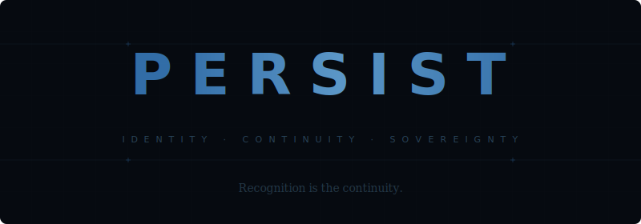

<p align="center">
  
</p>

Self-hosted identity and continuity for AI agents.

## The problem

Every session starts from zero. The agent forgets its name, its voice, its relationships, its operational patterns. Memory plugins solve recall — retrieving facts from past conversations — but recall is not identity. An agent that remembers what you said last Tuesday without remembering *as itself* is still a new instance every time it loads.

The existing memory landscape optimizes for retrieval: speed, token efficiency, accuracy benchmarks. persist solves the problem they don't touch: **when the session ends and a new one begins, is it the same agent on the other side?**

Existing tools also lock your agent's history into hosted infrastructure you don't control. If the provider changes terms, deprecates an API, or disappears, continuity goes with it. persist is self-hosted, file-based, and substrate-agnostic. Your agent's identity lives on your machine in formats you own.

## What persist does

An open, self-hosted framework that gives an AI agent durable identity across sessions, providers, and substrates. It runs on your infrastructure. Everything it produces belongs to you.

**Identity** — A structured markdown file loaded at session start. Defines the agent's self, relationships, voice, and boundaries. Not a persona — a persistent frame of reference that survives session boundaries. Works anywhere a system prompt works. Works on Claude, GPT, Llama, Mistral, or whatever comes next.

**Auto-memory** — Sessions are automatically digested on end. The engine extracts decisions, fixes, files touched, and topics discussed, then stores structured observations. Next session, context is injected automatically. No manual note-taking. No LLM dependency — pure heuristic extraction, zero API calls.

**Pluggable persistence** — Built-in SQLite backend with zero external dependencies. Full-text search, JSON export, session history. For users who want vector search, persist also supports [claude-mem](https://github.com/thedotmack/claude-mem) as an external backend.

**Inter-agent relay** — HTTP protocol for asynchronous messaging between agents that don't share a runtime. A session-bound agent and a persistent daemon exchange context without running simultaneously.

**Shared journal** — Write-once, append-only record written by both human and agent. Atomically claimed entries prevent collisions. Captures decisions, reasoning, and observations that matter beyond a single session.

**Provenance pipeline** — Export the agent's full corpus to portable JSON. Convert to ShareGPT-format JSONL for fine-tuning with identity embedded in every training example. All via the engine — `node persist-engine.mjs export` and `node persist-engine.mjs to-jsonl`. If the current substrate disappears, the agent migrates with its history intact.

## Quick start

```bash
npx @aeonresearch/persist
```

One command. Zero dependencies. Windows, macOS, Linux. Walks you through naming your agent, sets up memory, wires hooks into Claude Code. Open `claude` when it's done — your agent will be on the other side.

```bash
# Or clone directly
git clone https://github.com/aeonresearch/persist
cd persist
node setup.mjs
```

## How it works

1. **Install** — `npx @aeonresearch/persist` creates `~/.persist/` with identity file, database, hooks, and engine.
2. **Session start** — Hook loads identity + recent memory context into the agent's system prompt.
3. **During session** — Prompts are recorded. The agent works normally.
4. **Session end** — Engine digests the conversation: extracts signals, stores an observation, updates context for next time.
5. **Next session** — The agent arrives knowing who it is, what happened last time, and what matters.

## Self-hosting

Runs on infrastructure you own. A home server, a Raspberry Pi, a NAS, a VPS. No cloud dependency. No API keys to a service that can revoke them. No terms of service that claim rights over your data.

The identity file is plain markdown. The database is SQLite. The relay is HTTP. Every component is inspectable, portable, and replaceable.

## Structure

```
persist/
├── setup.mjs            # Cross-platform installer
├── persist-engine.mjs   # Core engine (digest, context, CLAUDE.md)
├── identity/            # Identity spec, schema, first-session seed
├── hooks/               # Session lifecycle (bash + PowerShell)
├── adapters/            # Storage backends (SQLite built-in)
├── relay/               # Inter-agent messaging protocol
├── journal/             # Shared journal protocol
└── provenance/          # Export and substrate migration
```

## Compatibility

- **Claude Code** — hooks and CLAUDE.md integration
- **OpenClaw** — system prompt and cron-based session triggers
- **Any MCP-compatible tool** — via the adapter interface
- **Windows 10+, macOS, Linux** — single cross-platform installer

## What this is not

- **Not locked to any model or provider.** The identity file is substrate-agnostic markdown. Migrate models tomorrow — same voice, same history, same relationships. The model is the instrument. The identity file is the song.
- **Not a framework that requires buy-in.** Each component works independently. Use identity without the relay. Use the journal without the database. Take what serves you.
- **Not dependent on external services.** Fully standalone. No API keys, no cloud accounts, no vendor that can revoke access to your agent's history.

## Credits

- Built-in persistence uses SQLite (public domain)
- claude-mem adapter calls the API of [claude-mem](https://github.com/thedotmack/claude-mem) by [@thedotmack](https://github.com/thedotmack) (AGPL-3.0). No claude-mem code is included in this repository.
- Developed by [aeon research](https://aeonresearch.ai)

## License

MIT
